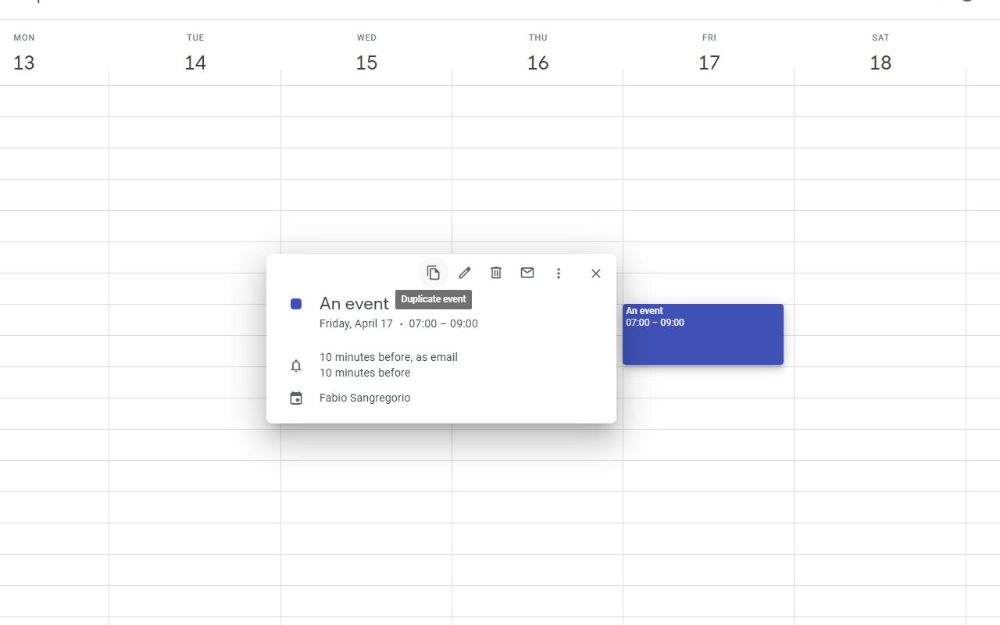

# Google Calendar Quick Duplicate

> A simple Chrome Extension to duplicate Google Calendar events in one click.

---

## 🚀 Features

- Adds a **"Duplicate event"** button to Google Calendar's event preview.
- Instantly duplicates events with a single click.
- **Pro-Tip:** Hold <kbd>Alt</kbd> (or <kbd>Option</kbd> on macOS) and click any event to duplicate it instantly.

---

## 🐞 Bugs & Feature Requests

Have feedback or found a bug?  
[Open an issue](https://github.com/fabiosangregorio/google-calendar-quick-duplicate/issues) on GitHub.

---

## 📦 Versioning

This project follows [Semantic Versioning](https://semver.org/):

- **X** — Major: Breaking changes
- **Y** — Minor: Backward-compatible improvements
- **Z** — Patch: Backward-compatible bug fixes

Chrome Web Store versions match GitHub releases.

---

**Enjoy duplicating! 🎉**
